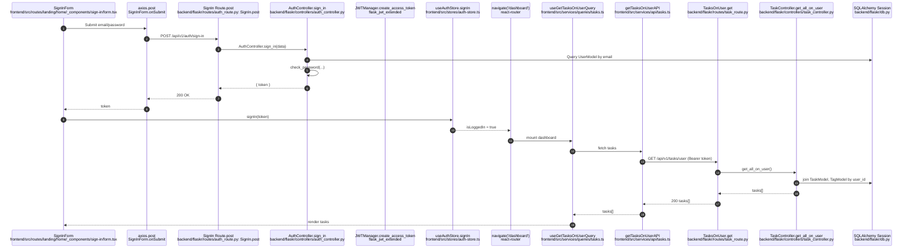
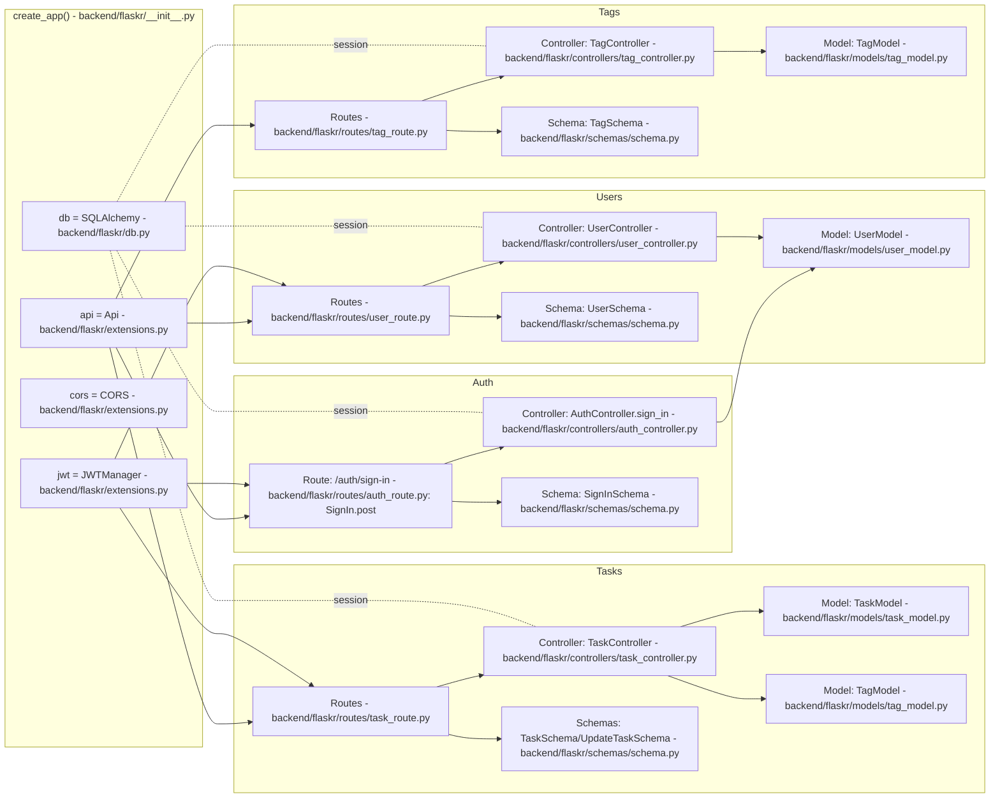

## Function and Module Relationships

### Login/User Flow Diagram (end-to-end)

- Sign-in page submits credentials
  - File: `frontend/src/routes/landing/home/_components/sign-in/form.tsx`
  - Component: `SignInForm`
  - Function: `onSubmit`
  - Sends POST to `/api/v1/auth/sign-in`
    ↓
- Backend route accepts request
  - File: `backend/flaskr/routes/auth_route.py`
  - Class: `SignIn`
  - Method: `post`
  - Validates with `SignInSchema`
    ↓
- Controller authenticates and returns JWT
  - File: `backend/flaskr/controllers/auth_controller.py`
  - Class: `AuthController`
  - Method: `sign_in`
  - Uses: `check_password`, `create_access_token`, `UserModel`
    ↓
- Frontend stores token and redirects
  - File: `frontend/src/stores/auth-store.ts`
  - Store: `useAuthStore`
  - Action: `signIn`
  - Then navigate to `/dashboard`
    ↓
- Dashboard loads data with JWT
  - File: `frontend/src/services/queries/tasks.ts`
  - Hook: `useGetTasksOnUserQuery`
  - Calls `getTasksOnUserAPI`
    ↓
- API call attaches Authorization header
  - File: `frontend/src/services/api/tasks.ts`
  - Function: `getTasksOnUserAPI`
  - Header: `Authorization: Bearer <token>`
    ↓
- Backend route (protected) reads JWT identity
  - File: `backend/flaskr/routes/task_route.py`
  - Class: `TasksOnUser`
  - Method: `get` (decorated `@jwt_required()`)
    ↓
- Controller fetches tasks for user
  - File: `backend/flaskr/controllers/task_controller.py`
  - Class: `TaskController`
  - Method: `get_all_on_user`
  - Uses: `get_jwt_identity`, `TaskModel`, `TagModel`, `db`

Notes:
- App factory wires everything
  - File: `backend/flaskr/__init__.py`
  - Function: `create_app`
  - Registers blueprints and initializes `db`, `api`, `cors`, `jwt` from `flaskr/extensions.py`.

#### Mermaid: Login/User Flow (sequence)

#### Mermaid: Backend Architecture (flowchart)

---

### Files, Classes, Functions Table

| File | Classes | Functions/Methods |
| --- | --- | --- |
| `backend/flaskr/__init__.py` | — | `create_app` |
| `backend/flaskr/extensions.py` | — | `migrate` (instance), `api` (instance), `cors` (instance), `jwt` (instance) |
| `backend/flaskr/db.py` | `Base` | `db` (SQLAlchemy instance) |
| `backend/flaskr/utils.py` | — | `generate_password`, `check_password` |
| `backend/config.py` | `Config`, `DevelopmentConfig`, `TestConfig` | — |
| `backend/flaskr/models/user_model.py` | `UserModel` | — |
| `backend/flaskr/models/task_model.py` | `TaskStatus`, `TaskModel` | — |
| `backend/flaskr/models/tag_model.py` | `TagModel` | — |
| `backend/flaskr/schemas/plain_schema.py` | `PlainUserSchema`, `PlainSignInSchema`, `PlainTagSchema`, `PlainTaskSchema` | — |
| `backend/flaskr/schemas/schema.py` | `UserSchema`, `SignInSchema`, `TagSchema`, `TaskSchema`, `UpdateTaskSchema` | — |
| `backend/flaskr/controllers/auth_controller.py` | `AuthController` | `sign_in` |
| `backend/flaskr/controllers/user_controller.py` | `UserController` | `get_all`, `get_by_id`, `create`, `delete` |
| `backend/flaskr/controllers/task_controller.py` | `TaskController` | `get_all_on_user`, `create`, `update`, `delete` |
| `backend/flaskr/controllers/tag_controller.py` | `TagController` | `get_all`, `create` |
| `backend/flaskr/routes/auth_route.py` | `SignIn` | `post` |
| `backend/flaskr/routes/user_route.py` | `Users`, `UserById`, `UserAccount` | `get` (x2), `post`, `delete` |
| `backend/flaskr/routes/task_route.py` | `Tasks`, `TasksOnUser`, `TaskById` | `post`, `get`, `put`, `delete` |
| `frontend/src/routes/routes.tsx` | — | `router` (createBrowserRouter call) |
| `frontend/src/routes/landing/root.tsx` | — | `LandingRoot` |
| `frontend/src/routes/landing/home/page.tsx` | — | `HomePage` |
| `frontend/src/routes/landing/home/_components/sign-in/form.tsx` | — | `SignInForm`, `onSubmit` (inner) |
| `frontend/src/routes/landing/home/_components/sign-in/card.tsx` | — | `SignInCard` |
| `frontend/src/routes/landing/home/_components/create-account/form.tsx` | — | `CreateAccountForm`, `onSubmit` (inner) |
| `frontend/src/routes/landing/home/_components/create-account/card.tsx` | — | `CreateAccountCard` |
| `frontend/src/routes/landing/_components/navbar.tsx` | — | `Navbar` |
| `frontend/src/routes/dashboard/root.tsx` | — | `DashboardRoot` |
| `frontend/src/routes/dashboard/page.tsx` | — | `DashboardHomePage` |
| `frontend/src/routes/dashboard/_components/navbar.tsx` | — | `Navbar` |
| `frontend/src/routes/dashboard/_components/tasks/card.tsx` | — | `TaskCard` |
| `frontend/src/routes/dashboard/_components/tasks/section.tsx` | — | `TasksSection` |
| `frontend/src/routes/dashboard/_components/tasks/status-badge.tsx` | — | `StatusBadge` |
| `frontend/src/routes/dashboard/_components/tasks/create-dialog.tsx` | — | `CreateDialog` |
| `frontend/src/routes/dashboard/_components/tasks/create-form.tsx` | — | `CreateForm` |
| `frontend/src/routes/dashboard/_components/tasks/edit-dialog.tsx` | — | `EditDialog` |
| `frontend/src/routes/dashboard/_components/tasks/edit-form.tsx` | — | `EditForm` |
| `frontend/src/routes/dashboard/_components/tasks/delete-dialog.tsx` | — | `DeleteDialog` |
| `frontend/src/routes/dashboard/_components/tasks/show-dialog.tsx` | — | `ShowDialog` |
| `frontend/src/routes/dashboard/_components/tags/section.tsx` | — | `TagsSection` |
| `frontend/src/routes/dashboard/_components/tags/tag-badge.tsx` | — | `TagBadge` |
| `frontend/src/routes/dashboard/_components/tags/loading-state.tsx` | — | `LoadingState` |
| `frontend/src/services/api/tasks.ts` | — | `getTasksOnUserAPI`, `createTaskAPI`, `updateTaskAPI`, `deleteTaskAPI` |
| `frontend/src/services/queries/tasks.ts` | — | `useGetTasksOnUserQuery` |
| `frontend/src/services/mutations/tasks.ts` | — | `useCreateTaskMutation`, `useUpdateTaskMutation`, `useDeleteTaskMutation` |
| `frontend/src/services/api/tags.ts` | — | `getTagsAPI` |
| `frontend/src/services/queries/tags.ts` | — | `useGetTagsQuery` |
| `frontend/src/schemas/auth-schema.ts` | — | `SignInFormSchema`, `CreateAccountFormSchema` |
| `frontend/src/schemas/task-schema.ts` | — | `CreateFormSchema`, `EditFormSchema` |
| `frontend/src/stores/auth-store.ts` | — | `useAuthStore` (store with actions `signIn`, `logout`) |
| `frontend/src/hooks/useSEO.ts` | — | `useSEO` |
| `frontend/src/lib/utils.ts` | — | `cn` |

---

### Additional Backend Relationships

- `create_app` (backend `flaskr/__init__.py`) initializes `db`, `api`, `cors`, `jwt` from `flaskr/extensions.py` and registers blueprints from `flaskr/routes/*`.
- Routes call Controllers, Controllers use Models and `db.session`.
- JWT:
  - Issued in `AuthController.sign_in` via `create_access_token`.
  - Required on protected routes via `@jwt_required()` (e.g., tasks, deleting user account).
  - `get_jwt_identity` provides `user_id` inside controllers.

### Additional Frontend Relationships

- `SignInForm` validates with `SignInFormSchema` and writes token via `useAuthStore.signIn`.
- Dashboard components use React Query hooks to fetch and mutate tasks, which call Axios API functions that attach the Authorization header using the stored token.
- Logout flow: `frontend/src/routes/dashboard/_components/navbar.tsx` calls `useAuthStore.logout`, then navigates to `/`.
